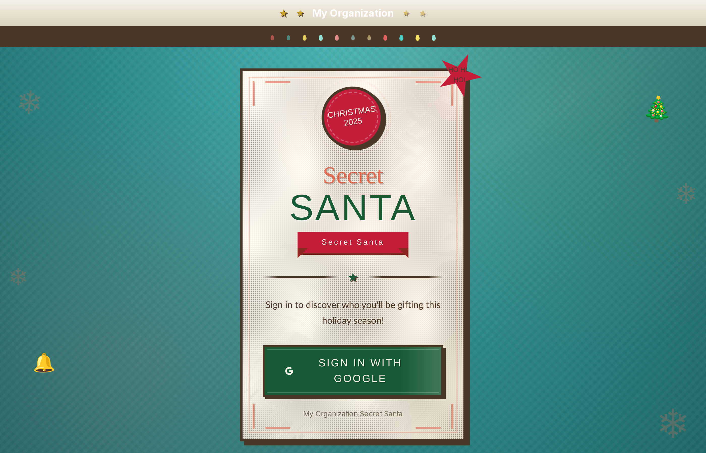

# Secret Santa

A beautiful, open-source Secret Santa application that you can self-host for your organization. Features a festive Christmas-themed UI with snowfall animations, multi-provider OAuth authentication, and comprehensive admin tools.



## Features

### Authentication & Security
- **Multi-provider OAuth**: Sign in with Google (Gmail/Workspace) or Microsoft (Outlook/365/Exchange/Azure AD)
- **Flexible Authentication**: Works with personal accounts or corporate SSO
- **Admin Access Control**: Configure multiple admin email addresses
- **Secure Sessions**: NextAuth.js powered authentication

### Setup & Configuration
- **Easy Setup Wizard**: First user configures everything through a guided 3-step web interface
- **No Code Required**: All configuration done through the UI
- **Organization Branding**: Upload your logo, set primary/secondary colors
- **Custom Messages**: Personalize homepage title, welcome message, and email footer

### Email System
- **Configurable SMTP**: Works with Gmail, Microsoft 365, or any SMTP server
- **Assignment Notifications**: Automatic emails when participants get their assignment
- **HR Notifications**: Optional copy to HR/organizer for each assignment
- **Bulk Reminder Emails**: Send reminders to participants who haven't picked yet
- **Custom Reminder Messages**: Add personalized notes to reminder emails
- **Test Email Function**: Verify SMTP settings before going live

### Admin Dashboard
- **Team Member Upload**: Import participants via Excel file (name, email columns)
- **Participation Tracking**: Real-time stats showing completed vs pending picks
- **Visual Progress Bar**: At-a-glance view of participation percentage
- **Assignment Overview**: See all Secret Santa pairings
- **Export to Excel**: Download complete assignment list
- **Pending Member List**: View who hasn't picked yet with selection checkboxes

### User Experience
- **Beautiful Christmas Theme**: Festive red and green design with snowfall animation
- **Responsive Design**: Works on desktop, tablet, and mobile
- **One-Click Assignment**: Simple "Pick My Secret Santa" button
- **Assignment Reveal**: Exciting reveal animation for gift recipient
- **Email Confirmation**: Participants receive their assignment via email

### Technical Features
- **Self-Hosted**: Run on your own infrastructure
- **Docker Ready**: Single container deployment
- **SQLite Database**: No external database server needed
- **Persistent Storage**: Data survives container restarts
- **Environment Variables**: Secure credential management

## Screenshots

| Home Page | Setup Wizard |
|-----------|--------------|
|  |  |

| Dashboard | Admin Panel |
|-----------|-------------|
|  |  |

| Settings | Participation Stats |
|----------|---------------------|
|  |  |

## Quick Start

### Prerequisites

- Docker and Docker Compose
- OAuth credentials from Google and/or Microsoft (see setup guide below)

### 1. Clone and Configure

```bash
git clone https://github.com/AnshumanMahato/secret-santa.git
cd secret-santa
cp .env.example .env
```

### 2. Get OAuth Credentials

You need at least one OAuth provider configured.

**For Google:**
1. Go to [Google Cloud Console](https://console.cloud.google.com)
2. Create a new project
3. Go to "APIs & Services" → "Credentials"
4. Create "OAuth 2.0 Client ID" (Web application)
5. Add authorized redirect URI: `https://your-domain.com/api/auth/callback/google`
6. Copy Client ID and Secret to your `.env` file

**For Microsoft:**
1. Go to [Azure Portal](https://portal.azure.com/#blade/Microsoft_AAD_RegisteredApps)
2. Register a new application
3. Add redirect URI: `https://your-domain.com/api/auth/callback/azure-ad`
4. Create a client secret
5. Copy Application ID and Secret to your `.env` file

### 3. Configure Environment

Edit `.env` with your OAuth credentials:

```env
# Required
NEXTAUTH_URL=https://your-domain.com
NEXTAUTH_SECRET=generate-a-random-string-here

# Google OAuth (optional if using Microsoft)
GOOGLE_CLIENT_ID=your-client-id
GOOGLE_CLIENT_SECRET=your-client-secret

# Microsoft OAuth (optional if using Google)
AZURE_AD_CLIENT_ID=your-client-id
AZURE_AD_CLIENT_SECRET=your-client-secret
AZURE_AD_TENANT_ID=common
```

Generate a secret:
```bash
openssl rand -base64 32
```

### 4. Start the Application

```bash
docker-compose up -d
```

### 5. Complete Setup

1. Open your browser to `https://your-domain.com`
2. Sign in with Google or Microsoft
3. You'll see the **Setup Wizard** - fill in:
   - Your organization name
   - Admin email addresses
   - SMTP settings for sending emails
   - Branding (logo, colors)
4. Click "Complete Setup"

That's it! Your Secret Santa is ready to use.

## How It Works

```
┌─────────────────────────────────────────────────────────────────┐
│                     SECRET SANTA WORKFLOW                        │
├─────────────────────────────────────────────────────────────────┤
│                                                                  │
│  1. SETUP ──────► First user runs setup wizard                  │
│                   Configure org name, branding, SMTP            │
│                                                                  │
│  2. UPLOAD ─────► Admin uploads Excel with participants         │
│                   Columns: name, email                          │
│                                                                  │
│  3. INVITE ─────► Share the URL with your team                  │
│                   Send reminder emails to pending members       │
│                                                                  │
│  4. PICK ───────► Participants sign in & click to reveal        │
│                   Random assignment with no duplicates          │
│                                                                  │
│  5. NOTIFY ─────► Email sent to participant with assignment     │
│                   Optional HR notification                      │
│                                                                  │
│  6. TRACK ──────► Admin monitors progress & exports data        │
│                   View stats, send reminders                    │
│                                                                  │
└─────────────────────────────────────────────────────────────────┘
```

## Admin Features

Access the admin panel by clicking "Admin Panel" in the navigation (visible to admin users only).

### Team Management
- **Upload Team Members**: Upload Excel file with `name` and `email` columns
- **Template Available**: Download sample CSV template for correct format
- **Batch Replace**: New upload replaces previous participant list

### Participation Monitoring
- **Real-time Stats**: Total members, completed picks, pending picks
- **Completion Percentage**: Visual progress bar
- **Pending List**: See exactly who hasn't participated yet

### Reminder System
- **Bulk Reminders**: Send to all pending members with one click
- **Selective Reminders**: Choose specific members to remind
- **Custom Messages**: Add personalized notes to reminder emails
- **Select All/Clear**: Quick selection controls

### Assignment Management
- **View All Assignments**: Table showing giver → receiver pairs
- **Email Status**: See if assignment email was sent successfully
- **Export to Excel**: Download complete list for records

### Settings Management
- **General**: Organization name, admin emails
- **Branding**: Logo upload, primary/secondary colors
- **Homepage**: Custom title and welcome message
- **Email**: SMTP configuration, from address, HR email, templates
- **Test Email**: Verify configuration before going live

## SMTP Configuration

The application needs SMTP access to send emails. Configure in the Settings page.

**Gmail:**
- Host: `smtp.gmail.com`
- Port: `587`
- Secure: No (uses STARTTLS)
- Use an [App Password](https://support.google.com/accounts/answer/185833) (not your regular password)

**Microsoft 365:**
- Host: `smtp.office365.com`
- Port: `587`
- Secure: No (uses STARTTLS)
- May need to [enable SMTP AUTH](https://docs.microsoft.com/en-us/exchange/clients-and-mobile-in-exchange-online/authenticated-client-smtp-submission)

**Amazon SES:**
- Host: `email-smtp.us-east-1.amazonaws.com` (use your region)
- Port: `587`
- Use IAM SMTP credentials

**Other providers**: Use your provider's SMTP settings

## Development

### Local Development

```bash
# Install dependencies
npm install

# Generate Prisma client
npx prisma generate

# Create database
npx prisma db push

# Start development server
npm run dev
```

Open http://localhost:3000

### Project Structure

```
secret-santa/
├── src/
│   ├── app/                    # Next.js App Router pages
│   │   ├── api/                # API routes
│   │   │   ├── admin/          # Admin APIs (upload, assignments, reminders)
│   │   │   ├── auth/           # NextAuth endpoints
│   │   │   ├── organization/   # Settings & branding APIs
│   │   │   └── secret-santa/   # Assignment API
│   │   ├── admin/              # Admin panel page
│   │   ├── dashboard/          # User dashboard page
│   │   ├── settings/           # Settings page
│   │   └── setup/              # Setup wizard page
│   ├── components/             # React components
│   │   └── Snowfall.tsx        # Snowfall animation
│   └── lib/                    # Utilities
│       ├── auth.ts             # NextAuth configuration
│       ├── db.ts               # Prisma client
│       ├── email.ts            # Email sending functions
│       └── organization.ts     # Settings management
├── prisma/
│   └── schema.prisma           # Database schema
├── public/
│   └── uploads/                # Uploaded logos
├── screenshots/                # Application screenshots
├── Dockerfile                  # Container build
├── docker-compose.yml          # Container orchestration
└── .env.example                # Environment template
```

### Database Schema

```prisma
model TeamMember {
  id
  name
  email (unique)
  isActive
  assignments (as giver)
  received (as receiver)
}

model Assignment {
  id
  giver → TeamMember
  receiver → TeamMember
  assignedAt
  emailSent
}

model Settings {
  id (singleton)
  organizationName
  logoUrl
  primaryColor, secondaryColor
  homepageTitle, homepageMessage
  smtpHost, smtpPort, smtpUser, smtpPassword, smtpSecure
  emailFrom, emailFromName, emailSubject, emailFooter
  hrEmail
  adminEmails
  setupComplete
}
```

## Troubleshooting

### "OAuth redirect URI mismatch"
- Ensure the redirect URI in your OAuth provider matches exactly
- Google: `https://your-domain.com/api/auth/callback/google`
- Microsoft: `https://your-domain.com/api/auth/callback/azure-ad`
- Check for trailing slashes

### Emails not sending
- Check SMTP credentials in Settings
- For Gmail, use an App Password (not regular password)
- Test with the "Send Test Email" button in Settings
- Check spam folder

### "Not authorized" errors
- Verify your email is in the admin emails list
- First user automatically becomes admin if no admins configured
- Check Settings → General → Admin Emails

### Database errors
- Ensure the `data` directory exists and is writable
- Check Docker volume mounts
- Run `npx prisma db push` to sync schema

### Logo not displaying
- Check `uploads` directory permissions
- Ensure Docker volume mount for `/app/public/uploads`
- Try re-uploading the logo

### Container won't start
- Check logs: `docker-compose logs secret-santa`
- Verify all required environment variables are set
- Ensure ports aren't already in use

## Environment Variables

| Variable | Required | Description |
|----------|----------|-------------|
| `NEXTAUTH_URL` | Yes | Full URL of your application |
| `NEXTAUTH_SECRET` | Yes | Random string for session encryption |
| `GOOGLE_CLIENT_ID` | No* | Google OAuth client ID |
| `GOOGLE_CLIENT_SECRET` | No* | Google OAuth client secret |
| `AZURE_AD_CLIENT_ID` | No* | Microsoft OAuth client ID |
| `AZURE_AD_CLIENT_SECRET` | No* | Microsoft OAuth client secret |
| `AZURE_AD_TENANT_ID` | No | Microsoft tenant (default: "common") |

*At least one OAuth provider (Google or Microsoft) must be configured.

## Security Considerations

- Store OAuth secrets securely (never commit to git)
- Use HTTPS in production
- Regularly rotate `NEXTAUTH_SECRET`
- SMTP passwords are stored encrypted in the database
- Admin emails should be verified corporate addresses

## License

MIT License - Free to use, modify, and distribute.

## Contributing

Contributions welcome! Please:
1. Fork the repository
2. Create a feature branch
3. Make your changes
4. Submit a pull request

## Support

- Open an issue for bugs or feature requests
- Check existing issues before creating new ones

---

**Happy Holidays!** 🎄🎅🎁
